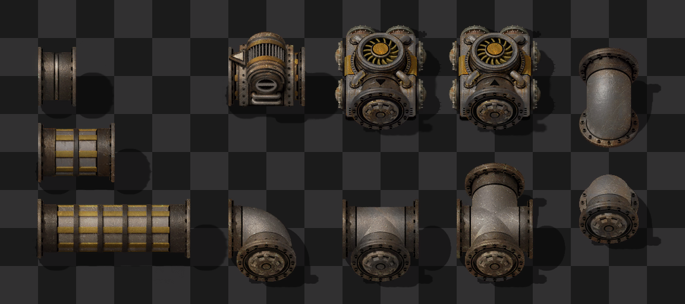
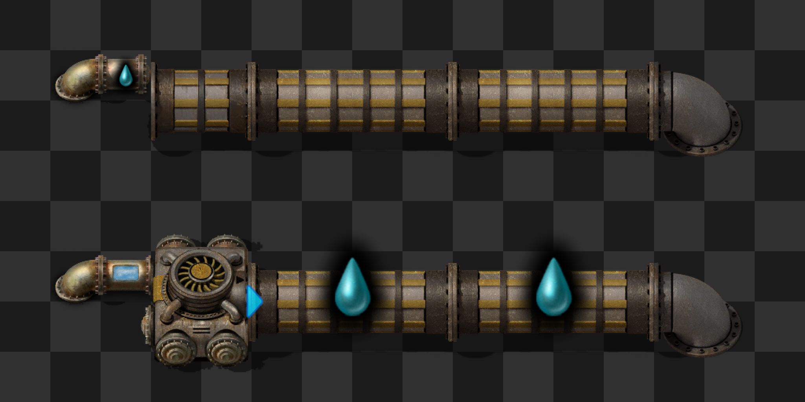

# Fluid Must Flow

A mod for Factorio that adds enormous ducts for transporting large volumes of liquids and gases.

## Installation

Download from the [Factorio mod portal](https://mods.factorio.com/mod/FluidMustFlow) from the in-game browser.

## Features

Fluid Must Flow adds ducts, which are enormous pipes useful for carrying large volumes of fluids long distances.

There are many individual components, including curves, t-junctions, and a non-return duct. Long stretches of straight ducts will be combined into fewer entities to improve throughput and save UPS.

Due to their large size, ducts cannot be directly connected to regular pipes. The Duct Intake and Duct Exhaust must be used to transfer fluids.

Ducts may be controlled using the circuit network for advanced setups.

## Credits

- **Krastor** - Artist.

- **Linver** - Original maintainer.

- **iicyan** - Wrote the original code for the mod.

- **raiguard** - Current maintainer and fixer-upper.
